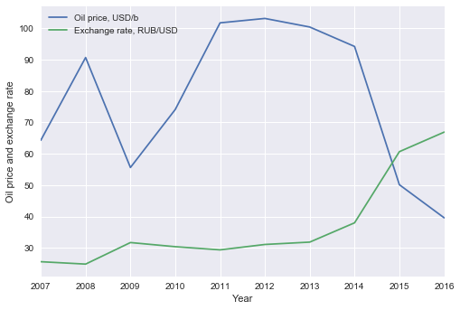
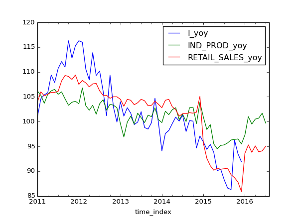
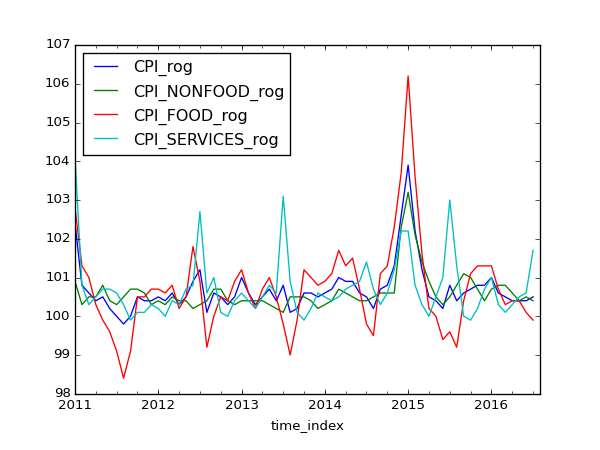
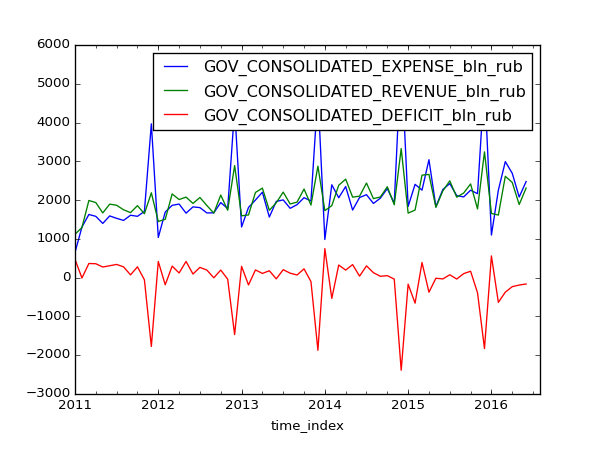
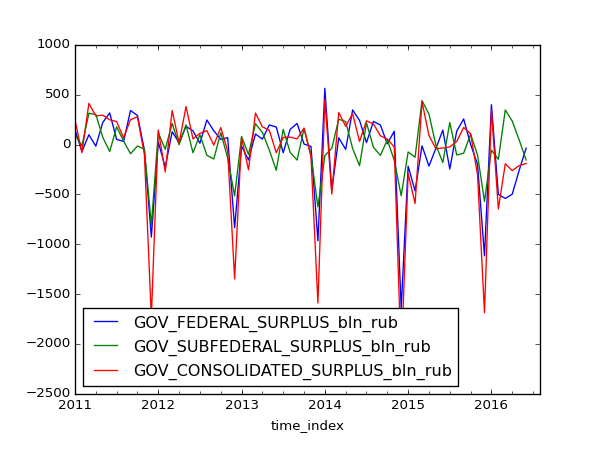
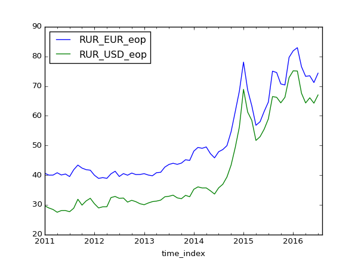
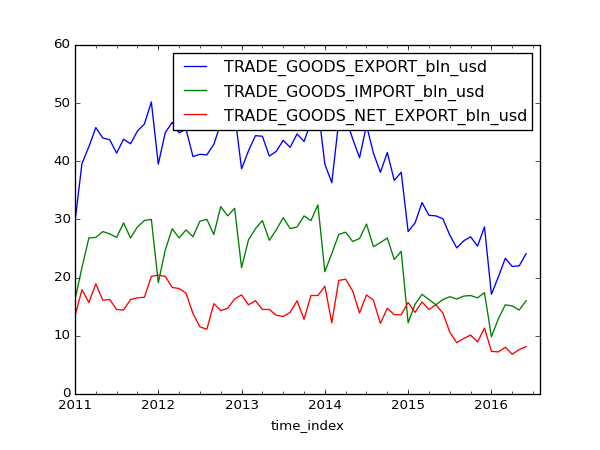
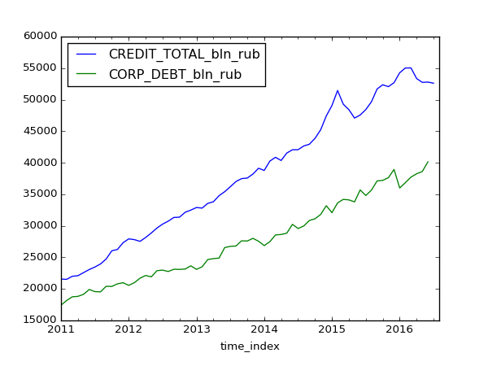
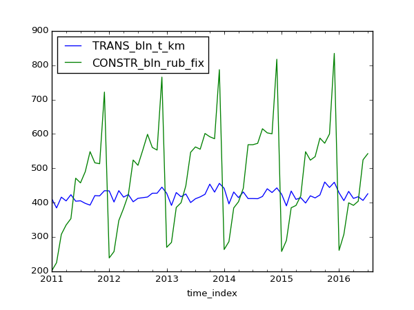
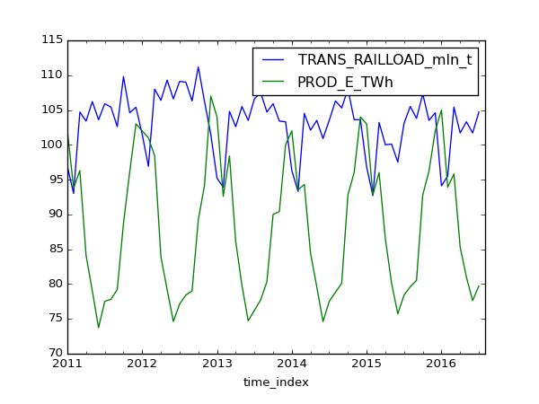

Exchange rate
=============
Key questions:
- oil as driver for ruble 
- observed capital flows 
- inflation differential 

Download data as [fx.xlsx](data/fx.xlsx) or [fx.csv](data/fx.csv)

Note: graph developped [here](https://github.com/epogrebnyak/viz_demo) 

Monthly stats
=============

Download data as [monthly.xlsx](data/monthly.xlsx) or [monthly.csv](data/monthly.csv)

Note: developped [here](https://github.com/epogrebnyak/data-lab) and [here](https://github.com/epogrebnyak/data-rosstat-kep)

To consider
===========

- Russian/English version
- Supporting data ETL
- Onepager graph for repost in FB

